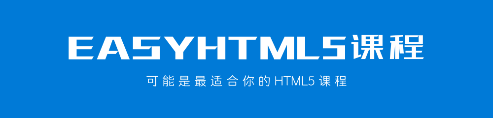
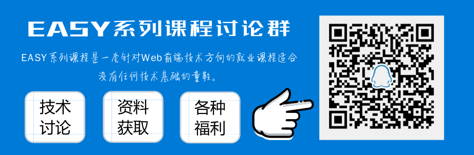

[使用 GitBook 在线阅读本课程](http://www.longestory.com/easy-html5/)

## 前言

本套课程共分为 15 个章节，几乎覆盖了目前 HTML5 中较为主流的新特性。但本套课程并非作为一个关于 HTML5 的 API 文档，而是努力成为最好的 HTML5 自学课程。

> **本套课程会一直更新，直到达到适合于所有人自学为止。**

15 个章节内容，大体上可以被分为以下几个部分内容:

> **说明:** 如果你已经掌握 HTML5 中的部分内容，可以根据自己的情况选择性的进行学习。

### 第一部分: 概念

作者首先从第一章节概念入手，先掌握什么是 HTML5、使用 HTML5 的原因以及目前 HTML5 的兼容性如何。

这部分内容，是你学习 HTML5 中后续内容的基础。概念清晰了，操作才会更顺手。学习概念，不仅仅只是单纯地阅读文字这么简单。要试着用自己的话来描述你所学习的概念，并把它发布到网络上，让别人替你检查，你的理解是否准确。

> 如果你不知道如何发布到网络上，可以加入底部的 QQ 讨论群，与其他人共同学习。

### 第二部分: 多媒体

作者将多媒体内容放在了第二章，足以说明目前 HTML5 提供的多媒体相关技术有多重要，这里的多媒体主要是以视频和音频为主。在 HTML5 技术出现之前，网页中的音频和视频多是依靠 Flash 技术实现，但 Flash 技术的性能和移动端支持并不好。

在这一章节中，作者会以视频技术为主讲解。因为，当你已经掌握视频技术之后，音频相对来讲会简单一些。后续，作者还会不断地增加案例的讲解。

> 你可以 **star** 或者 **watch** 本课程，这样一旦有更新，GitHub 会通知你。

### 第三部分: 图像

目前 HTML5 提供的有关图像的技术主要分为 Canvas、WebGL 和 SVG 这三个技术。作者会使用两个章节分别来讲解 Canvas 和 SVG 这两个技术，分别是第三章和第四章。

Canvas 技术是作为 HTML5 目前最为成熟的技术，允许作者在网页中进行绘制 2D 图像。而 SVG 矢量图在网页中的应用也越来越多，也是作者目前不能不掌握的 HTML5 内容。

### 第四部分: 离线 & 存储

第五章、第六章和第七章主要是学习 HTML5 中有关离线应用和存储的内容，分别是 Web 存储、文件系统和离线应用程序三个部分内容。这部分内容越来越多地在 Web 应用程序和今年很火的渐进式 Web PWA 应用。

Web 存储分别提供了 sessionStorage 和 localStorage，替代了原本的 Cookies 实现浏览器缓存。文件系统允许我们通过网页读取用户电脑中的文件，并且实现一些之前无法实现的效果，例如拖拽上传文件等功能。而离线应用程序主要是允许网页在没有网络的情况下继续使用，在联网的时候自动进行更新。

在这部分，作者会在后续添加有关渐进式 Web PWA 的相关内容，以让你掌握最新最热的应用方向所使用的技术内容。

> 你可以 **star** 或者 **watch** 本课程，这样一旦有更新，GitHub 会通知你。

### 第五部分: 通信 & 设备

这部分从第八章到第十五章结束，主要可以分为三个部分: 定位、通信和设备。定位是 HTML5 的舶来品，集成了 Google 公司的 Map 应用，而国内无法使用，所以作者换成了百度地图。通信主要分为 Web Workers、Web Sockets 和 Server-sent Events 三个技术内容，这些内容目前在游戏领域的应用比较多。最后的部分就是与设备相关的，分别是拖放、桌面通知、全屏和 Page Visibility等内容

这部分包含的方向和内容均较多，作者不断地进行补充，因为很难一次性涵盖所有重要的内容。再有，这部分内容要结合案例来学习，才会更好地理解和消化，所以作者还会不断补充案例。

> 你可以 **star** 或者 **watch** 本课程，这样一旦有更新，GitHub 会通知你。

## 反馈

本套课程会尽量完善，编写过程中难免出现纰漏。你可以通过以下展示方式进行反馈，作者会根据反馈及时更新和修改。

## 交流

你可以扫描下方的二维码，加入本套课程的 QQ 讨论群，与其他童鞋一起学习交流。

## 版权

本套课程的文本内容免费开源，任何人都可以免费学习、分享，甚至可以进行修改。但需要注明作者及来源，并且不能用于商业。

本套课程采用<a rel="license" href="http://creativecommons.org/licenses/by-nc-nd/4.0/">知识共享署名-非商业性使用-禁止演绎 4.0 国际许可协议</a>进行许可。

 